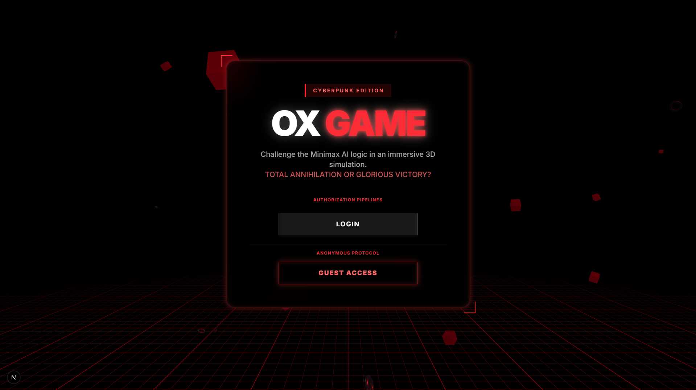
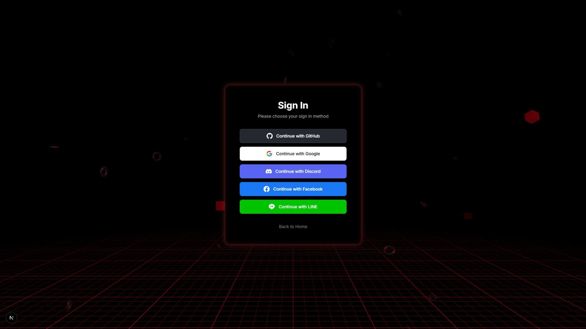
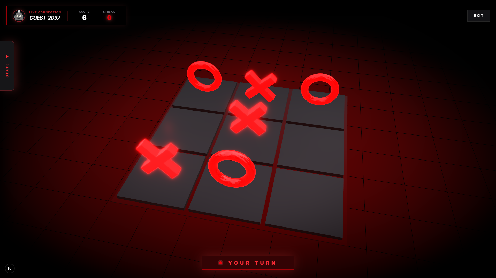
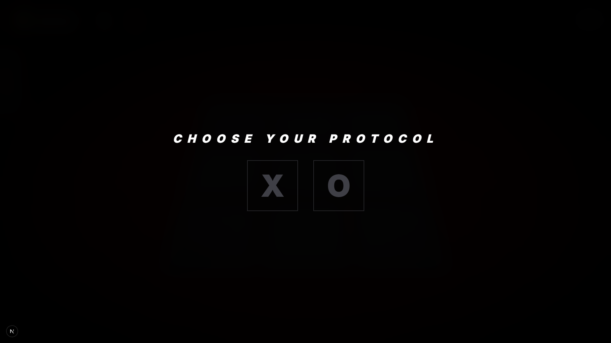
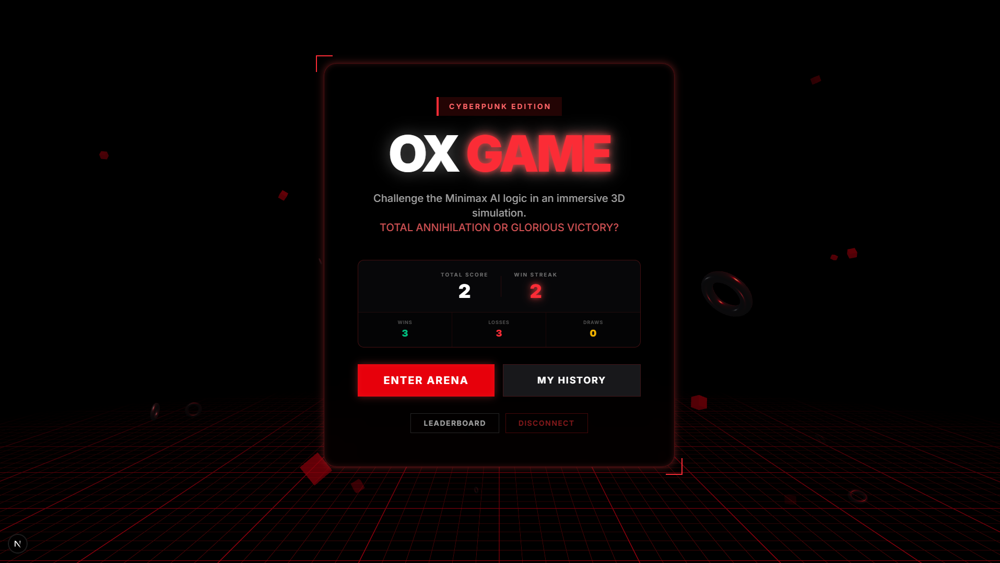
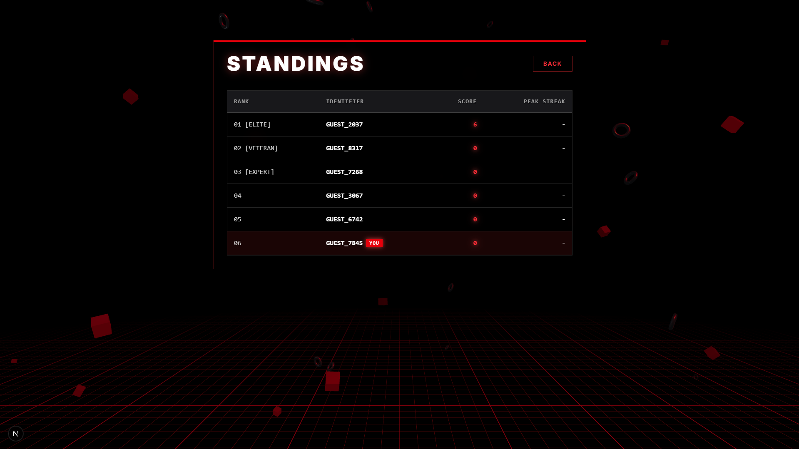
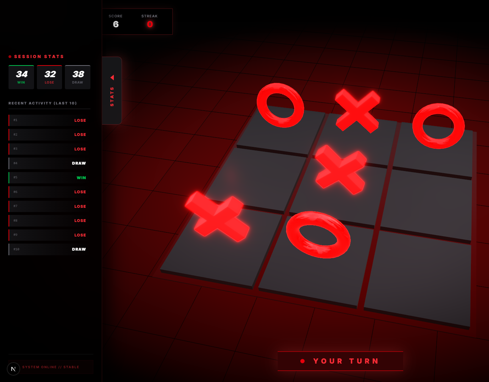
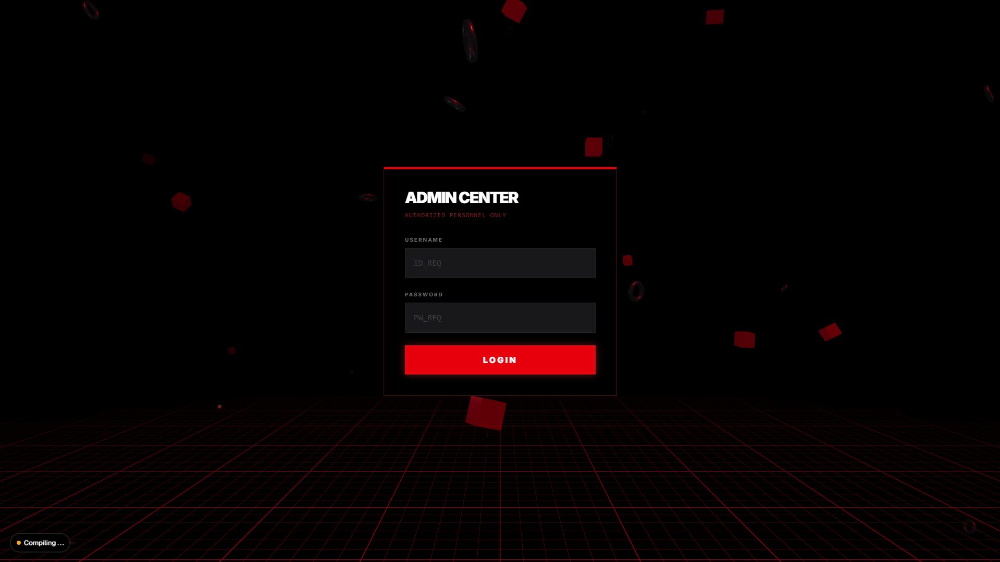
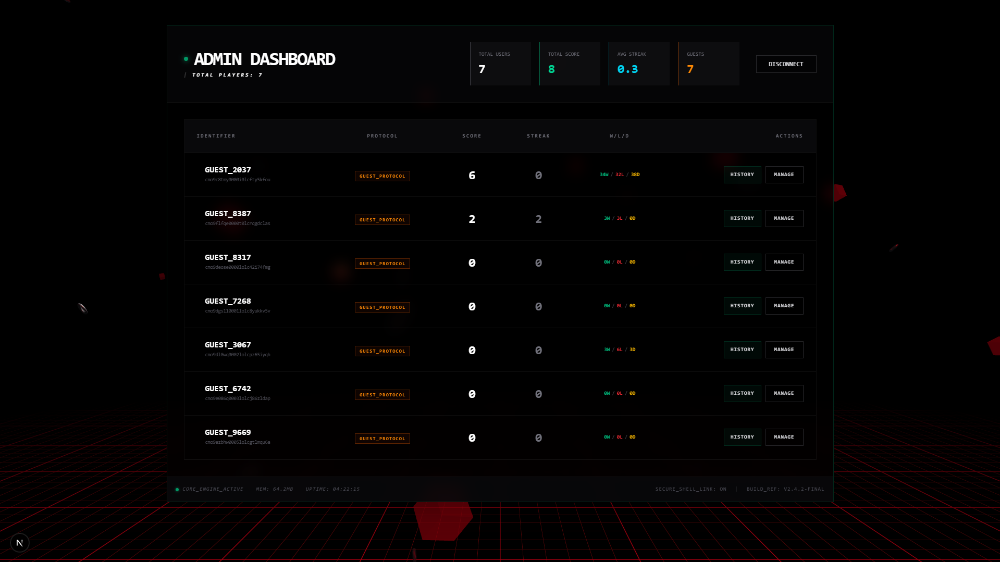
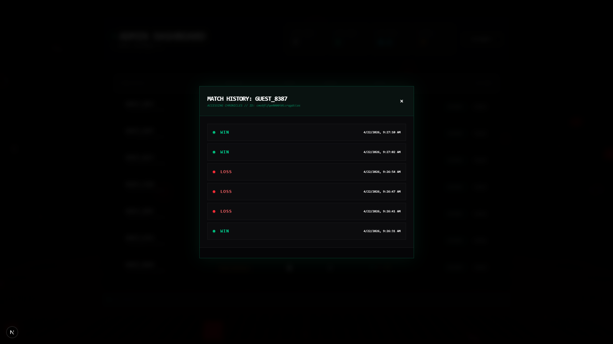

# 🚀 OX GAME 3D - CYBERPUNK EDITION

<div align="center">
  <kbd>
    
  </kbd>
  <br>
  <em>สัมผัสประสบการณ์เกม OX แบบ 3D ในโลกไซเบอร์พังค์ที่ล้ำสมัยที่สุด</em>
</div>

---

## 🛠️ TECH STACK & ARCHITECTURE
โปรเจกต์นี้ถูกสร้างขึ้นด้วยเทคโนโลยีที่ทันสมัย เพื่อความลื่นไหลและประสิทธิภาพสูงสุด:

- **Frontend:** [Next.js 16](https://nextjs.org/) (App Router) + [React 19](https://react.dev/)
- **3D Engine:** [Three.js](https://threejs.org/) & [React Three Fiber](https://docs.pmnd.rs/react-three-fiber)
- **Styling:** [Tailwind CSS v4](https://tailwindcss.com/) (Cyberpunk Theme)
- **Database:** [SQL Server](https://www.microsoft.com/sql-server) + [Prisma ORM](https://www.prisma.io/)
- **Authentication:** [NextAuth.js](https://next-auth.js.org/) (Social & Guest Login)
- **State:** [Zustand](https://github.com/pmndrs/zustand)

---

## 📸 FULL SHOWCASE GALLERY

### 🏁 Entry & Initialization
เริ่มการเดินทางของคุณด้วยระบบรักษาความปลอดภัยและการเข้าถึงที่หลากหลาย

<kbd>
  
</kbd>
<br>
<em>หน้าจอการตรวจสอบสิทธิ์ (Authorization Pipelines)</em>

### 🕹️ The Arena (Gameplay)
กระดาน OX 3D ที่ตอบสนองแบบ Real-time พร้อม Minimax AI

<kbd>
  
</kbd>
<kbd>
  
</kbd>
<br>
<kbd>
  
</kbd>
<br>
<em>บรรยากาศภายในสนามรบและการสรุปผลการปะทะ</em>

### 📊 Social & Statistics
เปรียบเทียบความแข็งแกร่งกับผู้เล่นทั่วโลกและตรวจสอบเกียรติประวัติส่วนตัว

<kbd>
  
</kbd>
<kbd>
  
</kbd>
<br>
<em>ตารางอันดับเกียรติยศ (Leaderboard) และ บันทึกสถิติส่วนบุคคล (Chronicles)</em>

### 🛡️ Admin Command Center (Root Access)
ระบบควบคุมศูนย์กลางสำหรับแอดมินเท่านั้น เพื่อความเป็นระเบียบเรียบร้อยของระบบ

<kbd>
  
</kbd>
<br>
<kbd>
  
</kbd>
<kbd>
  
</kbd>
<br>
<em>Dashboard วิเคราะห์ระบบ และ ระบบตรวจสอบประวัติการเล่นรายบุคคล</em>

---

## 🧩 FEATURE BREAKDOWN

### For Players (ระบบผู้เล่น)
- **Multi-Login:** รองรับ Google, GitHub และ Guest Mode
- **3D Immersion:** ฉากหลังและตัวกระดานเป็น 3D เต็มรูปแบบ
- **Dynamic Scoring:** ชนะได้คะแนน, แพ้เสียคะแนน, ชนะต่อเนื่อง (Streak) ได้โบนัส!
- **History Portal:** ดูประวัติการเล่นย้อนหลังของตัวเองได้ทันทีที่หน้าหลัก

### For Admin (ระบบแอดมิน)
- **Centralized Dashboard:** สรุปตัวเลขผู้เล่น, คะแนนรวม และสถานะระบบ
- **Player Control:** รีเซ็ตคะแนน หรือ ลบผู้เล่นที่ทำผิดกฎ
- **Deep Audit:** ตรวจสอบประวัติการเล่นของผู้เล่นทุกคนเพื่อความโปร่งใส
- **Security Persistence:** ระบบล็อกอินแอดมินใช้ Session-based เพื่อความปลอดภัยสูงสุด

---

## 🚀 INSTALLATION & SETUP

### 1. Environment Config (`.env`)
ตั้งค่าไฟล์ `.env` เพื่อเชื่อมต่อระบบ:
```env
# Database
DATABASE_URL="YOUR_SQL_SERVER_CONNECTION_STRING"

# Admin Access
ADMINID="YOUR_ADMIN_ID"
ADMINPW="YOUR_ADMIN_PASSWORD"

# NextAuth
NEXTAUTH_SECRET="RANDOM_STRING"
NEXTAUTH_URL="http://localhost:3000"


หากต้องการเชื่อมด้วย Social Login จะต้องกำหนด ID และ Secret ของแต่ละ Social Login
GITHUB_ID=
GITHUB_SECRET=

GOOGLE_CLIENT_ID=
GOOGLE_CLIENT_SECRET=

DISCORD_CLIENT_ID=
DISCORD_CLIENT_SECRET=

FACEBOOK_CLIENT_ID=
FACEBOOK_CLIENT_SECRET=

LINE_CLIENT_ID=
LINE_CLIENT_SECRET=
```

### 2. Quick Run
```bash
# Install Dependencies
npm install

# Database Synchronization
npx prisma db push
npx prisma generate

# Final Launch
npm run dev
```

---

